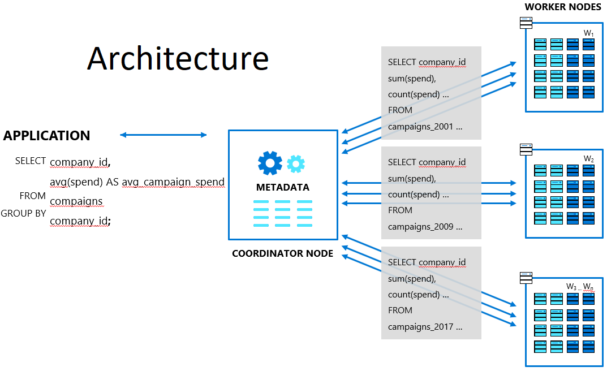

**Introduction to Hyperscale (Citus) on Azure Database for PostgreSQL**

Azure Database for PostgreSQL is a managed service that you use to run, manage, and scale highly available PostgreSQL databases in the cloud. These instructions will show you how to create an Hyperscale (Citus) on Azure Database for PostgreSQL server group using the Azure portal. You'll explore distributed data: sharding tables across nodes, ingesting sample data, and running queries that execute on multiple nodes.

