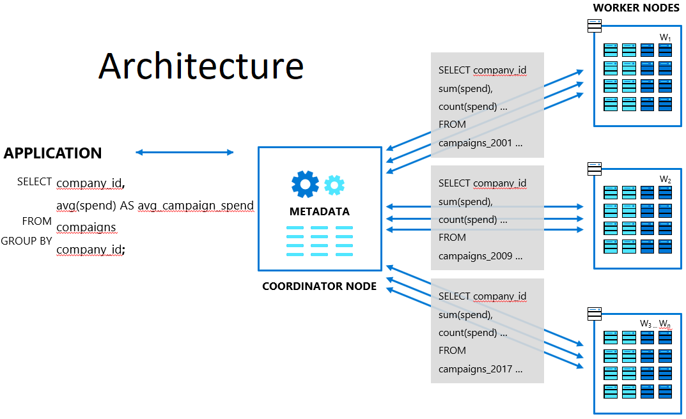

Introduction to Hyperscale (Citus) on Azure Database for PostgreSQL
-------------------------------------------------------------------

Azure Database for PostgreSQL is a managed service that you use to run, manage, and scale highly available PostgreSQL databases in the cloud. These instructions will show you how to create an Hyperscale (Citus) on Azure Database for PostgreSQL server group using the Azure portal. You'll explore distributed data: sharding tables across nodes, ingesting sample data, and running queries that execute on multiple nodes.

**Overview Hyperscale (Citus)**

The Hyperscale (Citus) on Azure Database for PostgreSQL is worry-free Postgres that is built to scale out. It distributes (shards), data and queries in a cluster of multiple machines. As an extension (rather than a fork), **Hyperscale (Citus)** supports new PostgreSQL releases, allowing users to benefit from new features while maintaining compatibility with existing PostgreSQL tools. It solves 2 main problems of performance and scalability with existing workloads. Along with the above, Hyperscale (Citus) also manages the database for you. It provides High Availability, Backups, Monitoring, Alerts and other bells and whistles that are typically part of a PAAS (Platform as a Service) offering.

**Hyperscale (Citus) Architecture:**

Every cluster has one special node called the coordinator (the others are known as workers). Applications send their queries to the coordinator node which relays it to the relevant workers and accumulates the results.
For each query, the **coordinator** either routes it to a single worker node, or parallelizes it across several depending on whether the required data lives on a single node or multiple. Below are some scenarios on how Hyperscale (Citus) distributes your queries across multiple workers.

First we need to log into the Azure portal with the provided credentials.

**Sign in to the Azure portal**
 
1.	If you are already logged into the Azure portal skip to the next page. Click **Next** on the bottom right of this window 
 
2.	In the browser navigate to https://portal.azure.com and maximize the browser window.
 
3.	If the Pick an account dialog shows up choose **+ Use another account**.
 
4.	In the Sign in dialog on the Email, phone or Skype field, enter the azure credentials you got after signup for the lab and click **Next**.

7.	You may encounter a popup entitled Stay signed in? with buttons for No and Yes - Choose **No**
 
8.	You may encounter a popup entitled Welcome to Microsoft Azure with buttons for Start Tour and Maybe Later - Choose **Maybe Later**.
 
9.	Click **Next** on the bottom right of this page.
