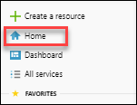
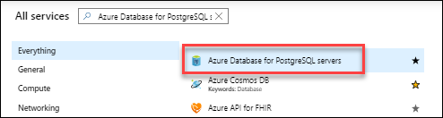
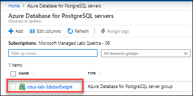

Getting started with Hyperscale (Citus) extension for PostgreSQL
-------------------------------------------------------------------

These instructions will instruct you on how to create a Hyperscale (Citus) server group using the Azure portal. Normally this takes about 10 minutes, however in the interest of time we have pre-created this for you. The following click steps will take you through the process so you know how simple and easy it is but at the end we will just use the one already created.

**Create a Hyperscale (Citus) on Azure Database for PostgreSQL**

Follow these steps to understand the process of creating a PostgreSQL Hyperscale (Citus) server group using the Azure portal.
 
1.	Click **+ Create a resource** in the upper left-hand corner of the Azure portal.

    
 
2.	Under Azure Marketplace select **Databases** from the New page, and select **Azure Database for PostgreSQL** from the Databases page.

    
 
3.	On the deployment option page, click the **Create** button under **Hyperscale (Citus) on Azure Database for PostgreSQL**.

    
 
4.	Fill out the new server details form with the following information 

     * Subscription: will be defaulted to your session's subscription     
     * Resource group: Click the select existing... drop down and select **airlift**-suffix
     * Server group name: Enter **airlift**-suffix
     * Admin username: currently required to be the value **citus**     
     * Password: Enter **Password1!** and also for Confirm Password
     * Location: Select **westus2**
     * Compute + Storage: Click Configure server group. Leave the settings in that section unchanged and click Save
     
       Note: When creating Hyperscale (Citus) deployments you are able to horizontally scale the number of worker nodes up to 20 nodes. If you need more than 20 nodes, just create a support ticket and we will enable that for you. You will be able to set up/down (vcores, storage) on all workers as well as the coordinator. RAM is a function of number of cores and type of server (controller or worker).
 
5.	Click **Review + create** to see a summary. At this point **DO NOT click Create** as we have already created it for you to save time.

    

       Note: If you clicked create, it would take up to 10 minutes to deploy. You would be redirected to a page that monitors the deployment while you wait.
 
6.	In the upper left of the Azure Portal click **Home**.

    
 
7.	Under Azure services click **Azure Database for PostgreSQL servers**.

    
 
8.	Click on **citus-lab-3suffix**

    
    
    
This is the Azure Portal overview blade which allows you to manage your Hyperscale (Citus) server group. On this **overview** tab you will see in the upper right the coordinator name which you will use to connect to the Server Group.
 
9.	On the left click on **Connection Strings** to see a number of connection string formats.
 
10.	On the left click on **Configure** to see your deployment configuration 
 

 

