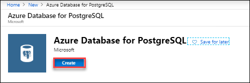
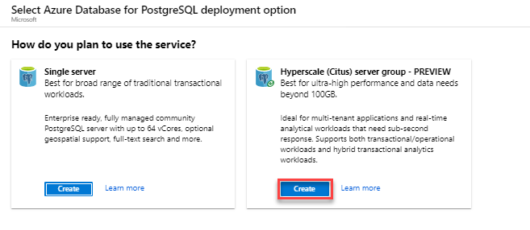
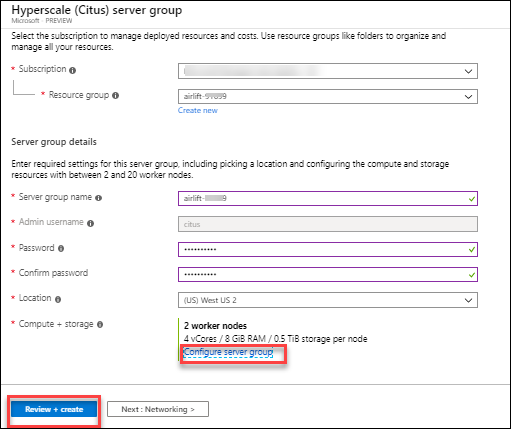

Getting started with Hyperscale (Citus) extension for PostgreSQL
-------------------------------------------------------------------

These instructions will instruct you on how to create a Hyperscale (Citus) server group using the Azure portal. Normally this takes about 10 minutes, however in the interest of time we have pre-created this for you. The following click steps will take you through the process so you know how simple and easy it is but at the end we will just use the one already created.

**Create a Hyperscale (Citus) on Azure Database for PostgreSQL**

Follow these steps to understand the process of creating a PostgreSQL Hyperscale (Citus) server group using the Azure portal.
 
1.	Click **+ Create a resource** in the upper left-hand corner of the Azure portal.

    
 
2.	Under Azure Marketplace select **Databases** from the New page, and select **Azure Database for PostgreSQL** from the Databases page.

    
 
3.	On the deployment option page, click the **Create** button under **Hyperscale (Citus) on Azure Database for PostgreSQL**.

    
 
4.	Fill out the new server details form with the following information 

     * Subscription: will be defaulted to your session's subscription     
     * Resource group: Click the select existing... drop down and select **airlift-<suffix> 
     * Server group name: Enter airlift-<suffix> 
     * Admin username: currently required to be the value citus     
     * Password: Enter **Password1!** and also for Confirm Password
     * Location: Select **westus2**
     * Compute + Storage: Click Configure server group. Leave the settings in that section unchanged and click Save
     
       Note: When creating Hyperscale (Citus) deployments you are able to horizontally scale the number of worker nodes up to 20 nodes. If you need more than 20 nodes, just create a support ticket and we will enable that for you. You will be able to set up/down (vcores, storage) on all workers as well as the coordinator. RAM is a function of number of cores and type of server (controller or worker).
 
5.	Click **Review + create** to see a summary. At this point **DO NOT click Create** as we have already created it for you to save time.

    

       Note: If you clicked create, it would take up to 10 minutes to deploy. You would be redirected to a page that monitors the deployment while you wait.
 
6.	In the upper left of the Azure Portal click Home 
 
7.	Under Azure services click Azure Database for PostgreSQL servers 
 
8.	Click on sg081303 
This is the Azure Portal overview blade which allows you to manage your Hyperscale (Citus) server group. On this overview tab you will see in the upper right the coordinator name which you will use to connect to the Server Group.
 
9.	On the left click on Connection Strings to see a number of connection string formats 
 
10.	On the left click on Configure to see your deployment configuration 
 
11.	Click Next on the bottom right of this page 
 
**Getting started with Hyperscale (Citus)**
In order to use the Azure Portal Cloud Shell to connect to the Hyperscale (Citus) server group we will need to create a storage account. The storage account allows you to save files associated with the Cloud Shell so you may use them in various Azure portal activities like running scripts, downloading data files and managing Azure resources.
Create a Cloud Shell
 
1.	On the portal banner click on the Cloud Shell icon 
 
2.	On the Welcome to Azure Cloud Shell click Bash 
 
3.	On the You have no storage mounted screen click Show advanced settings 
 
4.	Use the default values for subscription and region 
 
5.	Resource Group should be set to Use existing rg081303 
 
6.	For Storage account, select Create new and paste 
sg081303shell
in the field
 
7.	For File share, select Create new and enter 
sg081303shell
 
8.	Click Create Storage 
Note: This may take up to a minute to create and start the Cloud Shell
 
9.	We will need the client IP address of Cloud Shell to configure the firewall in the next step. At the command prompt enter the following command and press return then copy or note the IP address of your cloud shell 
curl -s https://ifconfig.co
Note: To paste in the bash console right click and choose paste.
 
10.	Click Next on the bottom right of this page 

**Getting started with Hyperscale (Citus)**

The Hyperscale (Citus) on Azure Database for PostgreSQL service uses a firewall at the server-level. By default, the firewall prevents all external applications and tools from connecting to the coordinator node and any databases inside. We must add a rule to open the firewall for a specific IP address range.
On the Overview pane in the upper right you will see the address of the coordinator hostname for the cluster that you will be connecting to.
Configure a server-level firewall rule
 
1.	On the left side navigation of the overview pane under Security click Firewall 
 
2.	Enter the IP address from your Cloud Shell in the START IP and END IP boxes 
 
3.	Enter the following into the FIREWALL RULE NAME 
CloudShell
 
4.	Click Save at the top left of the pane 
Note: Hyperscale (Citus) server communicates over port 5432. If you are trying to connect from within a corporate network, outbound traffic over port 5432 may not be allowed by your network's firewall. If so, you cannot connect to your Hyperscale (Citus) server unless your IT department opens port 5432.
 
5.	Click Next on the bottom right of this page 

 

