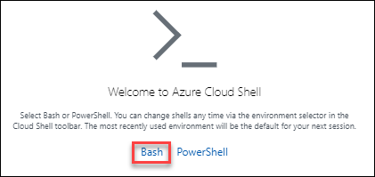
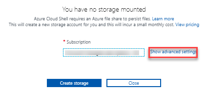
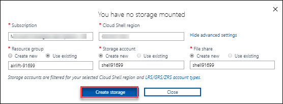
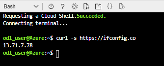
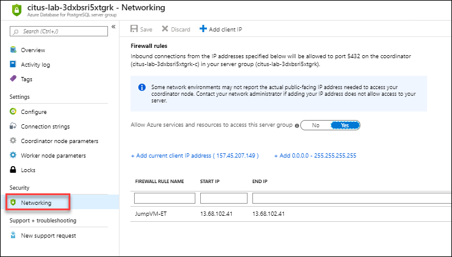
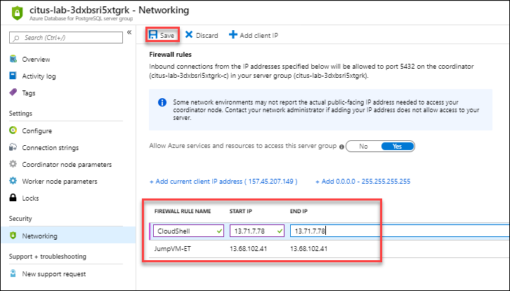

Getting started with Hyperscale (Citus)
---------------------------------------

In order to use the Azure Portal Cloud Shell to connect to the Hyperscale (Citus) server group we will need to create a **storage account**. The storage account allows you to save files associated with the Cloud Shell so you may use them in various Azure portal activities like running scripts, downloading data files and managing Azure resources.

## Create a Cloud Shell
 
1.	On the portal banner click on the **Cloud Shell icon**.

    
 
2.	On the Welcome to Azure Cloud Shell click **Bash**.

    
 
3.	On the You have no storage mounted screen click **Show advanced settings**.

    
 
4.	Use the default values for **subscription** and **region**.

5.	Resource Group should be set to Use existing **airlift-suffix**.
 
6.	For Storage account, select Create new and paste **shell(suffix)** in the field.
 
7.	For File share, select Create new and enter **shell(suffix)**.
 
8.	Click **Create Storage**



       Note: This may take up to a minute to create and start the Cloud Shell
 
9.	We will need the **client IP** address of Cloud Shell to configure the firewall in the next step. At the command prompt enter the following command and press return then copy or note the IP address of your cloud shell 
  * curl -s https://ifconfig.co
  
  
  
        Note: To paste in the bash console right click and choose paste.
 
## Getting started with Hyperscale (Citus)

The Hyperscale (Citus) on Azure Database for PostgreSQL service uses a firewall at the server-level. By default, the firewall prevents all external applications and tools from connecting to the coordinator node and any databases inside. We must add a rule to open the firewall for a specific IP address range.

On the Overview pane in the upper right you will see the address of the coordinator hostname for the cluster that you will be connecting to.

## Configure a server-level firewall rule
 
1.	On the left side navigation of the overview pane under Security click **Networking** 

    
 
2.	Enter the IP address from your Cloud Shell in the START IP and END IP boxes 

3.	Enter the following into the FIREWALL RULE NAME: **CloudShell**
 
4.	Click Save at the top left of the pane 

     

```
Note: Hyperscale (Citus) server communicates over port 5432. If you are trying to connect from within a corporate network, outbound traffic over port 5432 may not be allowed by your network's firewall. If so, you cannot connect to your Hyperscale (Citus) server unless your IT department opens port 5432.
```
 
## Connecting to Hyperscale (Citus) on Azure Database for PostgreSQL

When you create your Hyperscale (Citus) a default database named citus is created. To connect to your database server, you need a connection string and the admin password. Initial connections may take up to 2 minutes. If for any reason your shell times out and you restart it you will need to perform the curl -s https://ifconfig.co command again and ensure the firewall is updated with the new IP address.

## Connect to the database using Psql
 
1.	Click the **Maximize "square"** in the upper right of the Cloud Shell click to make it full screen.

     
 
2.	At the bash prompt, connect to your **Azure Database for PostgreSQL server** with the Psql utility. Initial connections may take up to 2 minutes. Copy and paste the following command and press **enter**. Don't forget to update host name with your PostgreSQL server v2 in which -c is added in suffix.
```
       psql "host=citus-lab-3dxbsri5xtgrk-c.postgres.database.azure.com port=5432 dbname=citus user=citus password=Password1! sslmode=require"
  ```  
    

**Create and scale out tables**

Once connected to the Hyperscale (Citus) coordinator node using Psql, you can complete some basic tasks.

In this experience, we'll primarily focus on distributed tables and getting familiar with them. The data model we're going to work with is simple: user and event data from GitHub. Events include fork creation, git commits related to an organization, and more. Once you've connected via Psql, let's create our tables.
 
3.	In the Psql console copy and paste the following to create the **tables**.

```
CREATE TABLE github_events ( event_id bigint, event_type text, event_public boolean, repo_id bigint, payload jsonb, repo jsonb, user_id bigint, org jsonb, created_at timestamp ); 

CREATE TABLE github_users ( user_id bigint, url text, login text, avatar_url text, gravatar_id text, display_login text );
```

   

The payload field of github_events has a JSONB datatype. JSONB is the JSON datatype in binary form in Postgres. The datatype makes it easy to store a flexible schema in a single column. Postgres can create a GIN index on this type, which will index every key and value within it. With an index, it becomes fast and easy to query the payload with various conditions. Let's go ahead and create a couple of indexes before we load our data.

4.	In the Psql console copy and paste the following to create the indexes

```
    CREATE INDEX event_type_index ON github_events (event_type);
    CREATE INDEX payload_index ON github_events USING GIN (payload jsonb_path_ops);
```

    

Next we’ll take those Postgres tables on the coordinator node and tell Hyperscale (Citus) to shard them across the workers. To do so, we’ll run a query for each table specifying the key to shard it on. In the current example we’ll shard both the events and users table on user_id.

5.	In the Psql console copy and paste the following to

```
    SELECT create_distributed_table('github_events', 'user_id'); 
    SELECT create_distributed_table('github_users', 'user_id');
```

   

For each table this command creates shards on the worker nodes. Each shard is a simple postgresql table that holds a set of users (as we sharded on user_id). It also creates metadata on the coordinator node to keep track of set of distributed tables and locality of shards on workers. As we sharded both the tables on user_id the tables are automatically colocated. This means that all the data related to a single user_id for both tables is on the same worker node. This helps when performing joins between the 2 tables locally on the worker nodes across the colocated shards.

    Note: Within Hyperscale (Citus) servers there are three types of tables
    
*	**Distributed Tables** : distributed across worker nodes (scaled out). Generally large tables should be distributed tables to improve performance.
*	**Reference tables** - Replicated to all nodes. Enables joins with distributed tables. Typically used for small tables like countries or product categories.
*	**Local tables** - tables that reside on coordinator node, administration tables are good examples of local tables.

We're ready to load data. The following commands will "shell" out to the Bash Cloud Shell and download the files.

6.	In the Psql console copy and paste the following to download the data files

       \! curl -O https://examples.citusdata.com/users.csv 
       \! curl -O https://examples.citusdata.com/events.csv
       
      

7.	In the Psql console copy and paste the following to load the data files

       \copy github_events from 'events.csv' WITH CSV 
       \copy github_users from 'users.csv' WITH CSV
       
      

For heavy production workloads where the COPY command is faster in Hyperscale (Citus) than single node postgres because COPY fans out and runs in parallel across the worker nodes.
Run queries
Now it's time for the fun part, actually running some queries. Let's start with a simple count (*) to see how much data we loaded.

8.	In the Psql console copy and paste the following to get a record count of github_events

       SELECT count(*) from github_events;
       
      

This simple query was refactored based on the shard key user_id you created early by the controller to all of the workers and returned the aggregate record count.
Within the JSONB payload column there's a good bit of data, but it varies based on event type. PushEvent events contain a size that includes the number of distinct commits for the push. We can use it to find the total number of commits per hour.

9.	In the Psql console copy and paste the following to see the number of commits by hour

       SELECT date_trunc('hour', created_at) AS hour, sum((payload->>'distinct_size')::int) AS num_commits FROM github_events WHERE event_type = 'PushEvent' GROUP BY hour ORDER BY hour;
       
      

Note: If you are stuck in the results view, type q and press Enter to quit view mode

So far the queries have involved the github_events exclusively, but we can combine this information with github_users. Since we sharded both users and events on the same identifier (user_id), the rows of both tables with matching user IDs will be co-located on the same database nodes and can easily be joined. If we join our query on user_id, the Hyperscale (Citus) controller will push the join execution down into shards for execution in parallel on worker nodes.

10.	In the Psql console copy and paste the following to find the users who created the greatest number of repositories.

        SELECT login, count(*) FROM github_events ge JOIN github_users gu ON ge.user_id = gu.user_id WHERE event_type = 'CreateEvent' AND payload @> '{"ref_type": "repository"}' GROUP BY login ORDER BY count(*) DESC LIMIT 20;
        
       

In production workloads the above queries are fast on Hyperscale (Citus) for the following reasons

   *	Shards are small, indexes are small. This helps in better resource utilization and better index/cache hit rates.
   *	Parallelism across multiple worker node.

 
## Conclusions

In this lab you’ve learned how to scale out Postgres horizontally on Microsoft Azure by provisioning a database cluster and configuring the sharding key. 

More specifically you learned how to

  * Provision a Hyperscale (Citus) server group on Azure Database for PostgreSQL
  * Create an Azure Cloud Shell
  * Connect to your Hyperscale (Citus) server using Psql
  * Create a schema, define the sharding key, and load the data into the server group

Hyperscale (Citus) on Azure Database for PostgreSQL enables you to distribute your data and your queries across a Postgres database cluster (what we call a ‘server group’), giving your application the performance benefits of all the memory, compute, and disk available on all the nodes in the server group.
If you would like to test Hyperscal (Citus) in your own subscription please use the following link
 *	[Quickstart create Hyperscale (Citus)](https://docs.microsoft.com/en-us/azure/postgresql/quickstart-create-hyperscale-portal)
Thank you for your time today and congratulations on finishing this experience.
